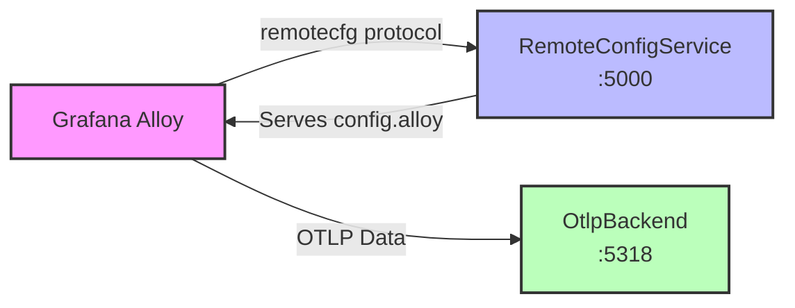
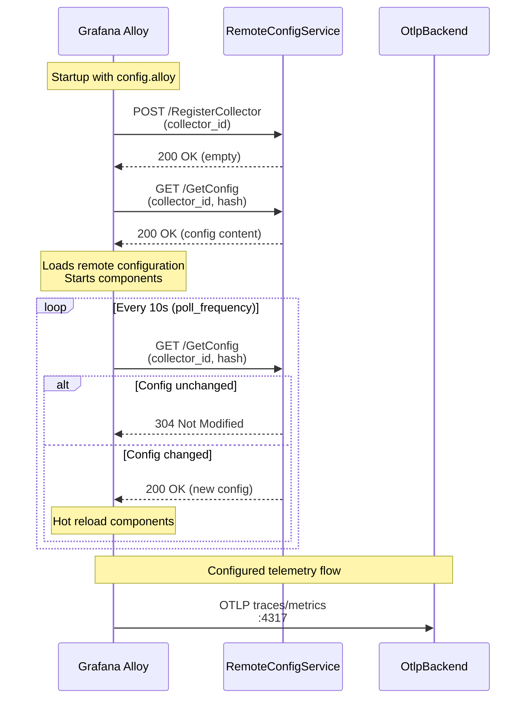

# Grafana Alloy Remote Config Demo

This project demonstrates dynamic configuration management for Grafana Alloy using a custom remote configuration service. The implementation features:

- **Remote Configuration Protocol**: Simple ASP.NET Core service implementing the Connect protocol (gRPC-compatible) to serve Alloy configurations
- **Dynamic Config Generation**: Server-side configuration customization based on collector ID (supports `service-alpha`, `service-beta`, and default profiles)
- **Hot Reload**: Alloy polls for configuration changes every 10 seconds and automatically reloads components
- **OTLP Pipeline**: Complete observability pipeline with OTLP receiver, basic auth, and exporter configuration
- **Multi-tenant Ready**: Each collector instance receives unique credentials and configuration based on its identifier

## Architecture Overview



### Components

**Grafana Alloy**
- The telemetry collector agent that manages the OTLP pipeline
- Starts with a minimal bootstrap configuration (`config.alloy`) containing only the `remotecfg` block
-   **File**: `config.alloy`
-   **Content**:
    ```alloy
    remotecfg {
      url = "http://localhost:5000"
      poll_frequency = "10s"
    }
    ```
    -  **Configuration Entries**:
    -   `url`: The HTTP endpoint of the remote configuration service that implements the Connect protocol
    -   `poll_frequency`: How often Alloy checks for configuration updates (10 seconds in this demo, allowing near real-time config changes)
- Connects to the RemoteConfigService to retrieve its full operational configuration
 
- Polls for configuration updates every 10 seconds and hot-reloads components when changes are detected
- Runs OTLP receivers on ports 4317 (gRPC) and 4318 (HTTP) to accept telemetry data
- Forwards collected telemetry to the configured backend with authentication
 

**RemoteConfigService (Port 5000)**
- A sample ASP.NET Core service implementing the Connect protocol (gRPC-compatible over HTTP)
- Handles two main endpoints:
  - `POST /collector.v1.CollectorService/RegisterCollector` - Registers collector instances
  - `GET /collector.v1.CollectorService/GetConfig` - Serves dynamic Alloy configurations
- Generates collector-specific configurations based on the collector ID
- Supports multi-tenant deployments by providing different credentials per collector profile
- Returns configurations containing OTLP receiver, exporter, and authentication components

**OtlpBackend (Port 5318)**
- Mock OTLP receiver that simulates a real observability backend
    - **File**: `OtlpBackend/Program.cs`
    - **Endpoint**: `http://localhost:5318`

- Accepts OTLP data (traces, metrics, logs) via HTTP POST
- Logs incoming requests including authorization headers and content details
- In production, replace with real collectors like Grafana Alloy, ADOT Collector, or OpenTelemetry Collector
 
**Note**: This is a minimal mock for demonstration purposes. In production deployments, use a real OTLP collector such as:
    -   [Grafana Alloy](https://grafana.com/docs/alloy/latest/)
    -   [AWS Distro for OpenTelemetry (ADOT) Collector](https://aws-otel.github.io/docs/getting-started/collector)
    -   [OpenTelemetry Collector](https://opentelemetry.io/docs/collector/)

> **⚠️ CAUTION**: The OtlpBackend service logs authorization headers and decoded credentials (username/password) for demonstration purposes. This is **NOT** suitable for production use. In production environments, **never log sensitive credentials** in plain text. Implement proper security practices including secure credential storage, audit logging without exposing secrets, and compliance with security policies.

### Data Flow
1. Alloy starts and registers with RemoteConfigService using its collector ID
2. RemoteConfigService generates and returns a custom configuration
3. Alloy loads the configuration and starts the OTLP receiver components
4. Telemetry data sent to Alloy is forwarded to OtlpBackend with basic authentication
5. Configuration changes are automatically detected and applied without restart

## Interaction Sequence


## How to Run

### Prerequisites
- [.NET 10.0 SDK](https://dotnet.microsoft.com/download/dotnet/10.0) or later
- [Grafana Alloy](https://grafana.com/docs/alloy/latest/get-started/install/) installed

### Step-by-Step Instructions

#### 1. Start the Mock OTLP Backend
Open a terminal and run:
```powershell
cd OtlpBackend
dotnet run --urls "http://localhost:5318"
```
The backend will start on `http://localhost:5318` and log incoming OTLP requests.

#### 2. Start the Remote Config Service
Open a second terminal and run:
```powershell
cd RemoteConfigService
dotnet run --urls "http://localhost:5000"
```
The service will start on `http://localhost:5000` and serve Alloy configurations.

#### 3. Start Grafana Alloy with Bootstrap Config
Open a third terminal and run:
```powershell
alloy run config.alloy
```

Alternatively, to test different collector profiles:
```powershell
# For service-alpha profile
alloy run config-alpha.alloy

# For service-beta profile
alloy run config-beta.alloy
```

#### 4. Verify the Setup

**Check Remote Config Service logs:**
```text
[RemoteConfig] Method: POST, RPC: RegisterCollector
[RemoteConfig] RegisterCollector ID: <collector-id>
[RemoteConfig] Method: GET, RPC: GetConfig
[RemoteConfig] Sending response for GetConfig. Size: <bytes>
```

**Check Alloy logs:**
```text
msg="starting complete graph evaluation" controller_path=/ controller_id=remotecfg
msg="finished node evaluation" ... node_id=otelcol.receiver.otlp.default
```

**Check OTLP Backend logs (when telemetry flows):**
```text
[OTLP Backend] Received request at /v1/traces
[OTLP Backend] Authorization: Basic <credentials>
```

#### 5. Send Test Telemetry Data

Send a sample OTLP log record to verify Alloy is receiving and forwarding data:

```powershell
curl -X POST http://localhost:4318/v1/logs `
  -H "Content-Type: application/json" `
  -d '{
    "resourceLogs": [{
      "resource": {
        "attributes": [{
          "key": "service.name",
          "value": {"stringValue": "test-service"}
        }]
      },
      "scopeLogs": [{
        "logRecords": [{
          "timeUnixNano": "1670000000000000000",
          "severityText": "INFO",
          "body": {"stringValue": "Test log message from curl"},
          "attributes": [{
            "key": "test.attribute",
            "value": {"stringValue": "test-value"}
          }]
        }]
      }]
    }]
  }'
```

You should see the request logged in the OtlpBackend terminal with the authorization header containing the credentials configured for your collector ID.

#### 6. Test Dynamic Configuration Changes

Modify `RemoteConfigService/Program.cs` to change the configuration (e.g., update credentials or endpoint). Alloy will automatically detect and apply the changes within 10 seconds without restart.

### Troubleshooting

- **Port 4317 already in use**: Stop other OTLP receivers or modify the port in the remote config
- **Connection refused**: Ensure RemoteConfigService is running on port 5000
- **No telemetry data**: Send test data to Alloy's OTLP receiver on `localhost:4317` or `localhost:4318`

## References

- [Grafana Alloy Remote Config API Definition](https://github.com/grafana/alloy-remote-config) - Official protocol buffer definitions and API specification
- [Grafana Alloy `remotecfg` Block Documentation](https://grafana.com/docs/alloy/latest/reference/config-blocks/remotecfg/) - Official documentation for remote configuration setup
- [Connect Protocol Specification](https://connectrpc.com/docs/protocol/) - Details on the Connect RPC protocol used for communication
- [OpenTelemetry Collector Components in Alloy](https://grafana.com/docs/alloy/latest/reference/components/otelcol/) - Reference for `otelcol.*` components used in the pipeline
